# Vision Cluster

## Maximizando a Exatidão no Cuidado Ocular

### A cirurgia de catarata é um dos procedimentos oftalmológicos mais comuns e eficazes, realizada para restaurar a visão em pacientes que sofrem de catarata, uma condição onde a lente natural do olho torna-se opaca.

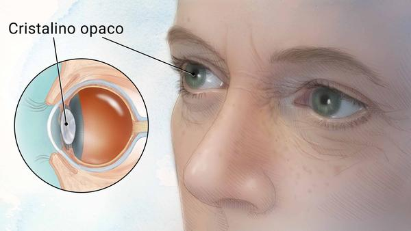

### Apesar dos avanços tecnológicos e da eficácia comprovada da cirurgia, ainda existem desafios significativos na personalização do tratamento para alcançar os melhores resultados possíveis para cada paciente. Esses desafios incluem, mas não se limitam a:

-   ### Variação nas Medidas Oculares
-   ### Previsão de Necessidades de Lentes
-   ### Otimização dos Protocolos de Tratamento

### Riscos e complicações associados à cirurgia

-   ### Infecção ocular
-   ### Inflamação
-   ### Edema macular
-   ### Deslocamento do implante intraocular
-   ### Glaucoma

# Dados

### Neste projeto, utilizamos um conjunto de dados composto por medidas detalhadas dos olhos de pacientes submetidos à cirurgia de catarata.

-   ### AL = comprimento axial do olho
-   ### ACD = profundidade de câmara anterior
-   ### WTW = distância brando a branco
-   ### K1 = curvatura no meridiano menos curvo
-   ### K2 = curvatura no meridiano mais curvo

## Redução de Dimensionalidade: PCA vs. t-SNE

### Para entender melhor a estrutura dos nossos dados e facilitar a visualização da dispersão dos grupos identificados pelos algoritmos de clustering, utilizamos duas técnicas poderosas de redução de dimensionalidade.

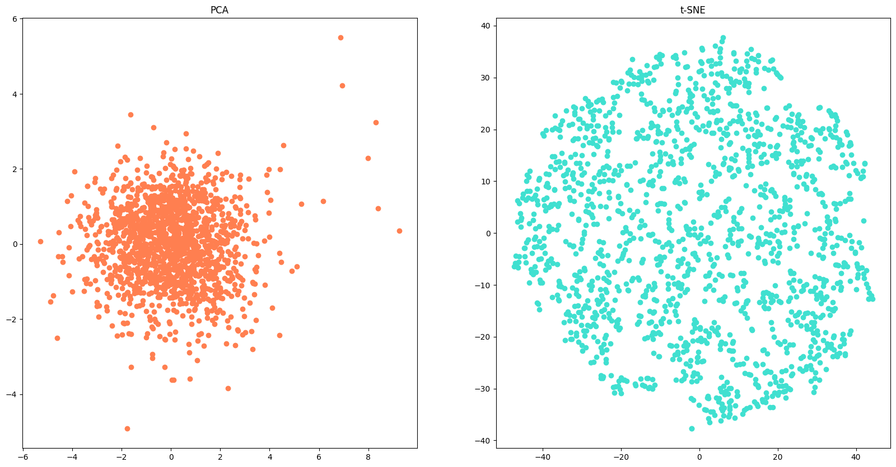

## Técnica Utilizada: K-means

### Para segmentar os pacientes em grupos com características oculares similares, empregamos o algoritmo de clustering K-means. Este método é ideal para nosso propósito devido à sua simplicidade, eficiência e eficácia em agrupar dados com base em similaridades.

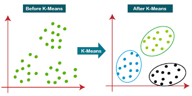

## Determinação do Melhor Valor de K

### A escolha do número ótimo de clusters é crucial para a eficácia do K-means. Utilizamos o método do cotovelo, complementado pela análise de silhueta, para determinar o melhor valor de K. Ao plotar a soma das distâncias quadradas intra-cluster em função de diferentes valores de K, buscamos o ponto em que a curva começa a achatar, o "cotovelo".

## Analise de resultado para K in [ 8, 9, 10 , 11]
### Utilizamos os algoritimos já comentados para redução da dimencionalidade.

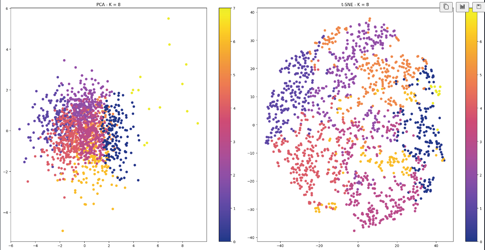
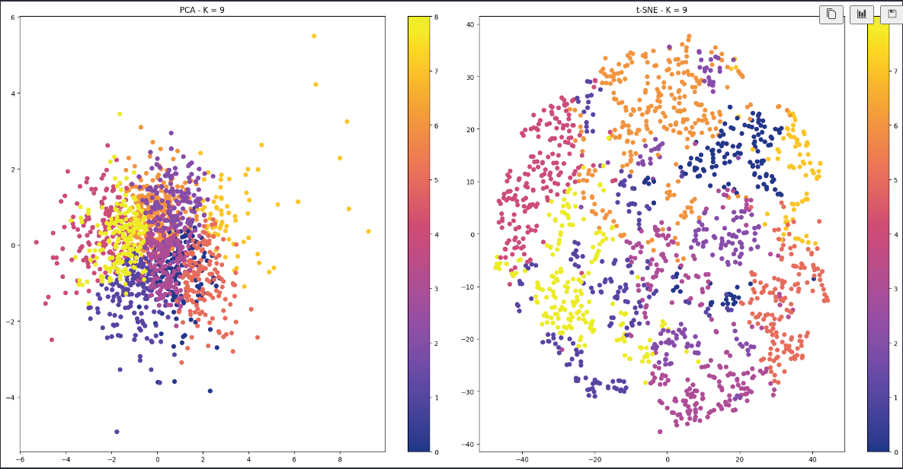
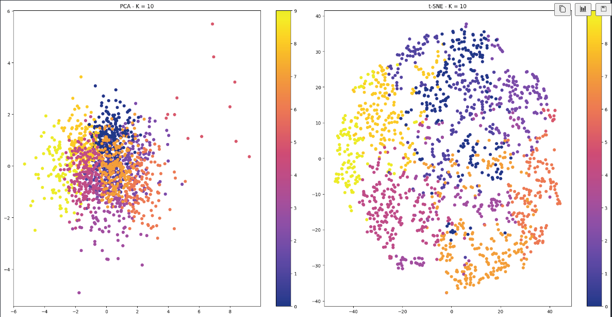
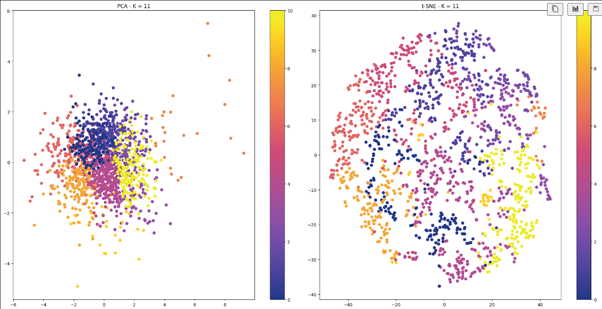

## Ruido?
### Na projeção que utiliza o algoritimo PCA podemos notar alguns pontos distantes dos demais, será que podemos trata los como  "outliers"?
### Descrição dos dados:
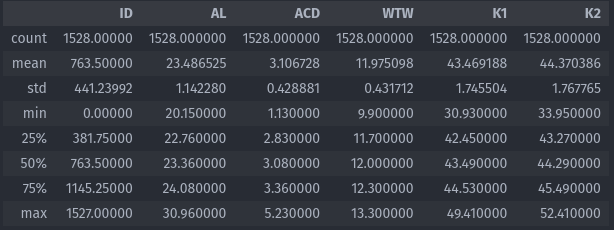

## Segunda Técnica Utilizada: K-medoids
### Conhecido por sua robustez a outliers. Resultados para K in [8, 9 ,10, 11]
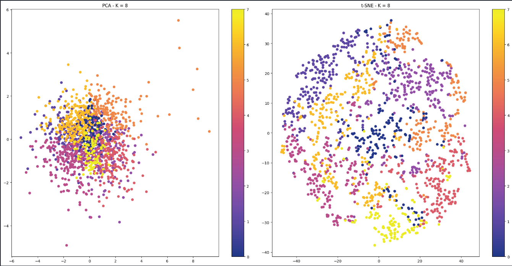
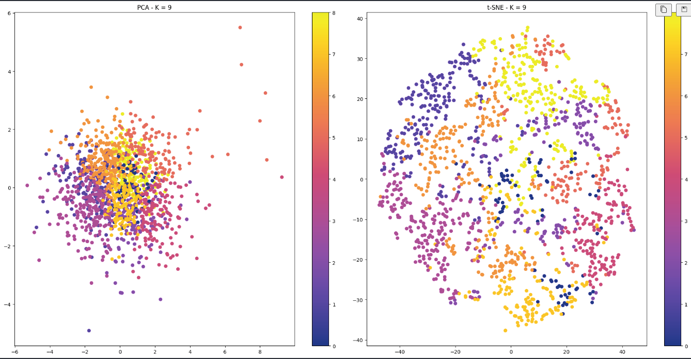
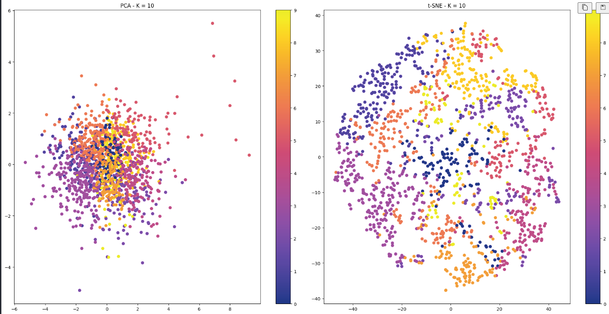
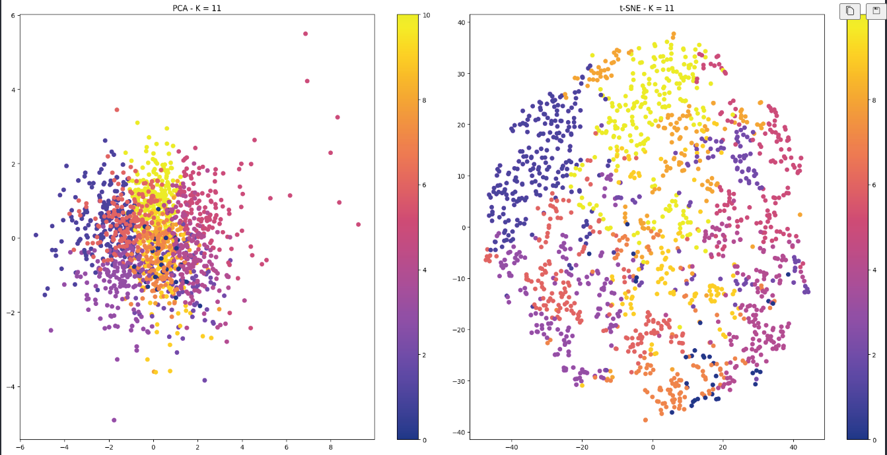

# Referências
- https://www.scikit-yb.org/en/latest/api/cluster/elbow.html
- 