# Vision Cluster: Maximizando a Exatidão no Cuidado Ocular

A cirurgia de catarata é um dos procedimentos oftalmológicos mais comuns e eficazes, realizada para restaurar a visão em pacientes que sofrem de catarata, uma condição em que a lente natural do olho torna-se opaca.

## Desafios no Tratamento da Catarata
Apesar dos avanços tecnológicos, ainda enfrentamos desafios significativos na personalização do tratamento para alcançar os melhores resultados possíveis, tais como:

- Variação nas Medidas Oculares
- Previsão de Necessidades de Lentes
- Otimização dos Protocolos de Tratamento

### Riscos e Complicações Associados à Cirurgia
- Infecção ocular
- Inflamação
- Edema macular
- Deslocamento do implante intraocular
- Glaucoma

## O Conjunto de Dados
Utilizamos medidas detalhadas dos olhos de pacientes submetidos à cirurgia de catarata, incluindo:

- AL = Comprimento axial do olho
- ACD = Profundidade da câmara anterior
- WTW = Distância branco a branco
- K1 = Curvatura no meridiano menos curvo
- K2 = Curvatura no meridiano mais curvo
- correto = "Qualquer coisa?"

### Destriuição do dados: Notemos que os dados são extremamente consistentes.

  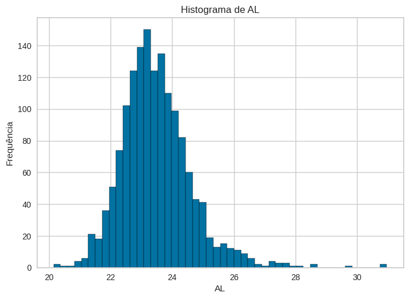
  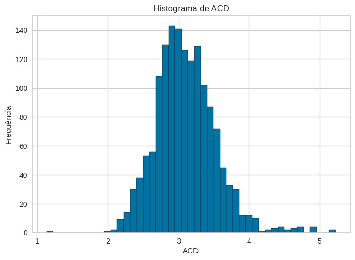
  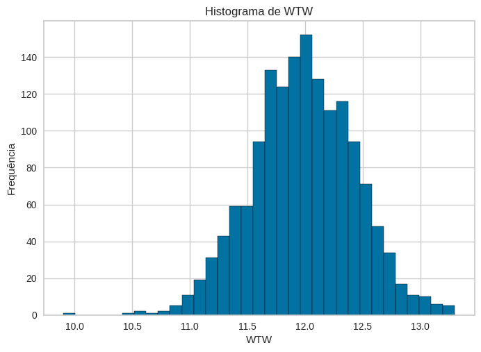

  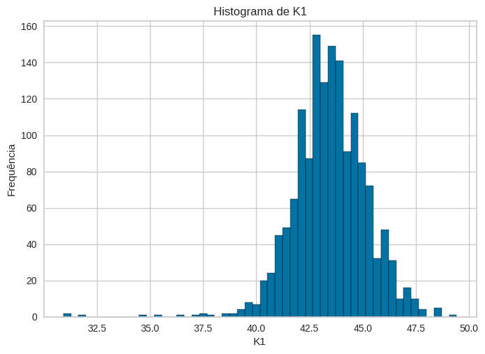
  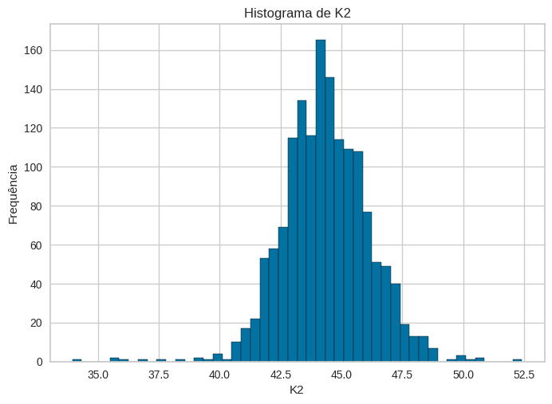

## Análise e Técnicas de Clustering

### Redução de Dimensionalidade: PCA vs. t-SNE
Utilizamos PCA e t-SNE para facilitar a visualização dos grupos identificados pelos algoritmos de clustering.

## Segmentação de Pacientes
## K-means e K-Medoids
Empregamos o algoritmo K-Means e K-Medoids para agrupar pacientes com características oculares similares, mostrando-se eficaz na segmentação dos dados.

### Determinação do Melhor Valor de K
O método do cotovelo, complementado pela análise de silhueta, nos ajudou a determinar o número ótimo de clusters(KElbowVisualizer).

  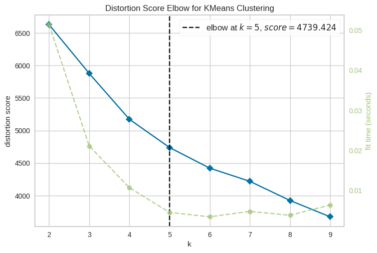
  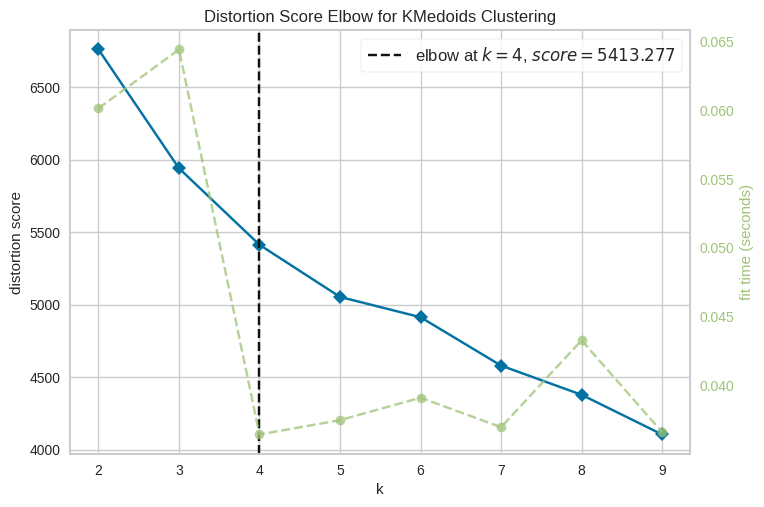

## Análise de Resultados para K in [4 e 5]
Exploramos os resultados da segmentação para diferentes valores de K, avaliando a formação dos clusters.

# KMeans
  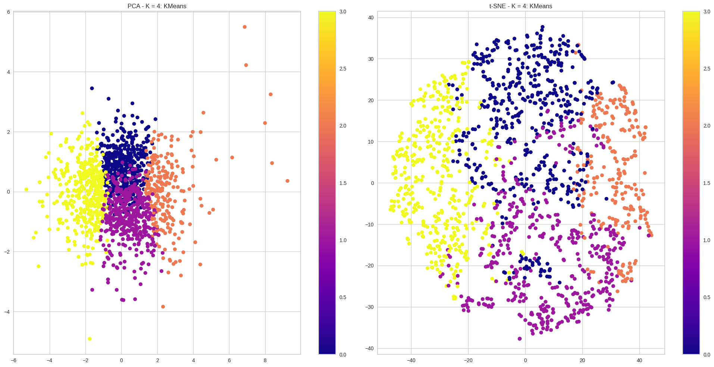
  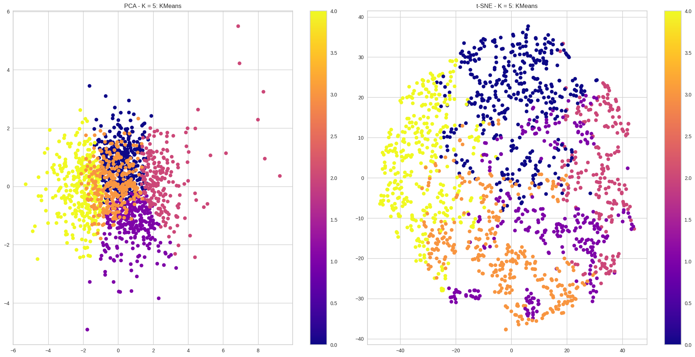

# KMedoids
  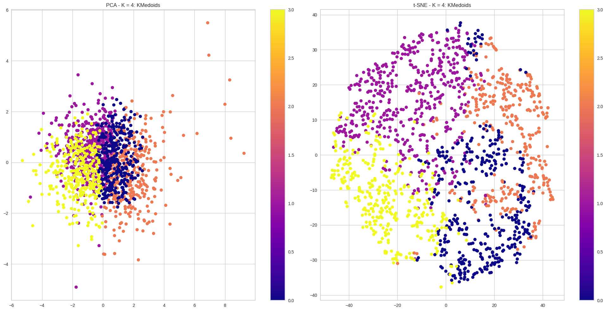
  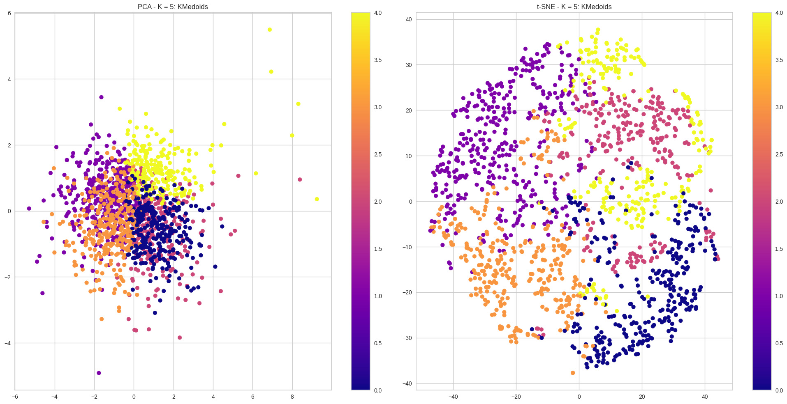

# Seleção de modelo
## Encontramos exelentes clusters, entretanto não podemos "Abraçar o mundo, queremos o melhor!"
## Métricas de Avaliação de Clusters

### Silhouette Score
- **Descrição**: Mede a coerência dos clusters. 
- **Interpretação**: Valores próximos a +1 indicam clusters bem definidos e separados.

### Davies-Bouldin Score
- **Descrição**: Avalia a separação e densidade dos clusters.
- **Interpretação**: Scores menores significam clusters melhor separados e mais compactos.

### Inércia
- **Descrição**: Reflete a soma das distâncias ao quadrado dos pontos de dados até o centro do cluster mais próximo.
- **Interpretação**: Valores menores indicam clusters mais densos e bem definidos.
  
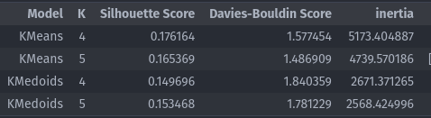

# Mapeamento dos Clusters KMeans

  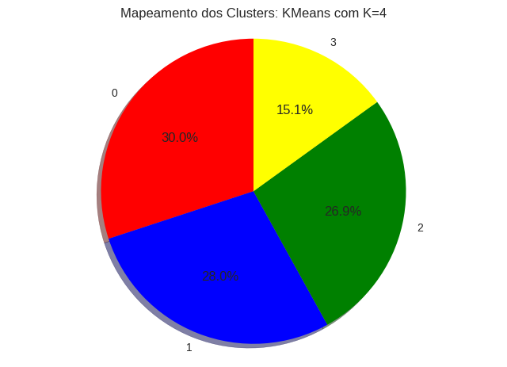
  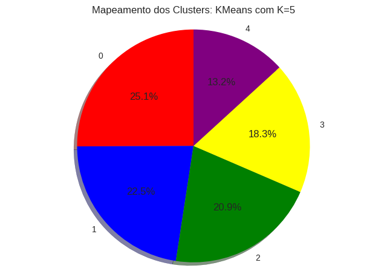

# Consideração Final: Bloxplot
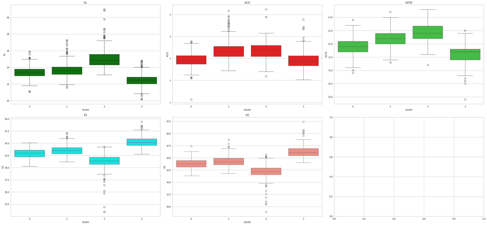

# Referências
- [Método do Cotovelo - scikit-yb](https://www.scikit-yb.org/en/latest/api/cluster/elbow.html)
